# Foodie Web — Order Booking Web Application

**Repository:** [https://github.com/shafi7425/Restuarant-Website-Project---Full-Stack-Development](https://github.com/shafi7425/Restuarant-Website-Project---Full-Stack-Development)  

---

**Website Live Link:** [Foodie Web](https://restuarant-website-project-full-sta-two.vercel.app/)

## 👥 Group Members

- **Shafi Ullah**
- **Noman Haider**
- **Tabish Arslan**
- **Hassan Naseer**

---

## 💡 Project Idea

A restaurant website inspired by the Asia Food. Customers can browse the menu, add items to a cart, place orders; admins manage menu items, track order, users, and orders. The special menu update on daily basis. 

## 🎯 Target audience
Targeting Asian people to provide authentic asian food taste. 

---

## Project Overview
Foodie Web is a **full-stack restaurant management application** built with:

- **Backend:** Python (Flask)  
- **Frontend:** Vanilla JS with modern modular structure  

## Group Members Roles

-- Shafi Ullah  | Backend - Dashboard api writes- authorizition- authentication- frontend login page and registration page- frontend dashboard design - orders page, announcement bar - dashboard page

-- Noman Haider  | Backend - frontend api calling ---  frontend design - mongo db setup and handling - frontend dashboard design - dishes - blogs -categories pages

-- Hassan Naseer  | Frontend design , checkout page, cart page, order confirmation page, order tracking page

-- Tabish Arslan  | Frontend design homepage , about us page, single product page - header - footer

Everything done by team collabration. 


### Features:
- Role-based authentication (Admin/User)  
- Admin dashboard: manage orders, dishes, blogs, announcements  
- Announcement slider with smooth professional design  
- Order filters, pagination, and modal viewer  
- Analytics charts for revenue, users, and orders  

---

## Getting Started (Local Setup)

### 1. Clone repository:
```bash
git clone https://github.com/shafi7425/Restuarant-Website-Project---Full-Stack-Development.git
cd Restuarant-Website-Project---Full-Stack-Development

....................................................................................
....................................................................................

2. Backend Setup:

cd backend
python -m venv venv
# Activate virtual environment:
# Linux/macOS:
source venv/bin/activate
# Windows:
venv\Scripts\activate

pip install -r requirements.txt
python app.py

Backend will run at: http://127.0.0.1:5000

....................................................................................
....................................................................................

3. Frontend Setup:

cd frontend
npm install
npm run dev

Frontend will run at: http://localhost:5173

....................................................................................
.................................................................................... 
```
## 🧑‍🔬 Functionalities of Application


## Landing Page
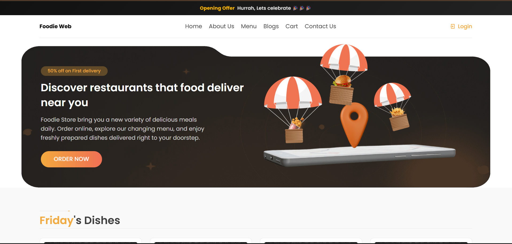

## product page 
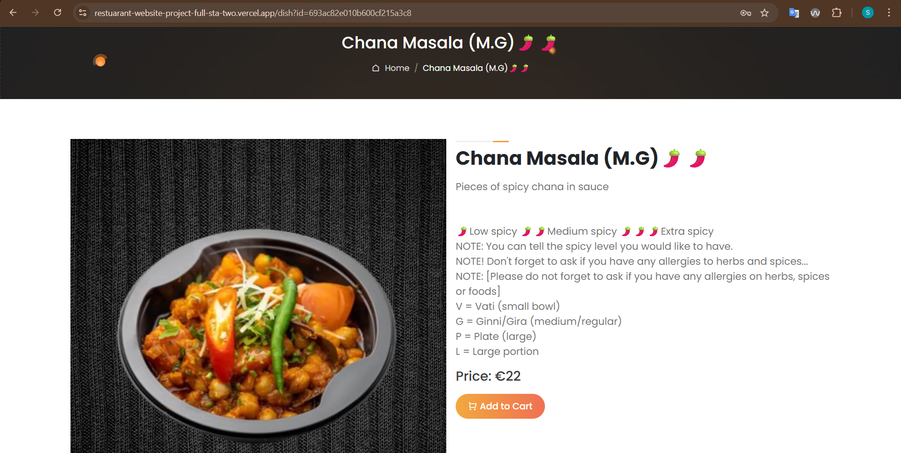

## Cart Page
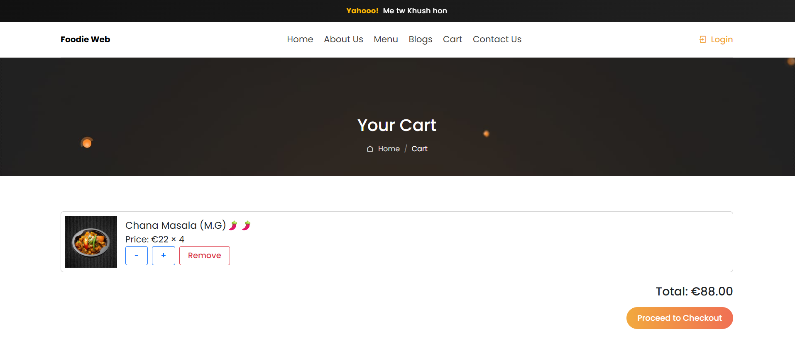


## To place order must sign up
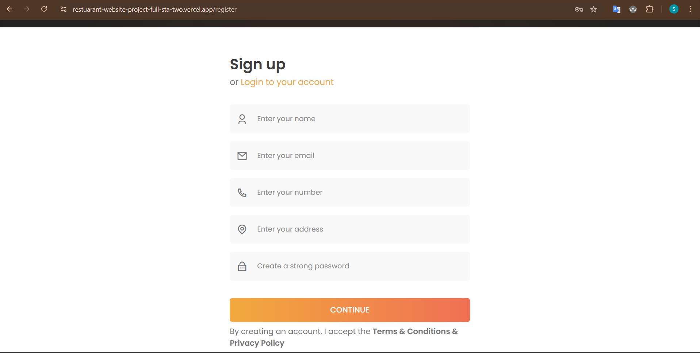


## Checkout Page

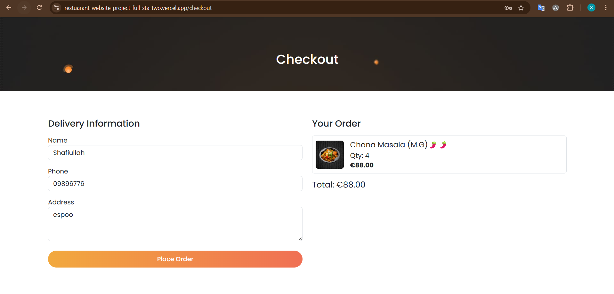

## Order confirmation
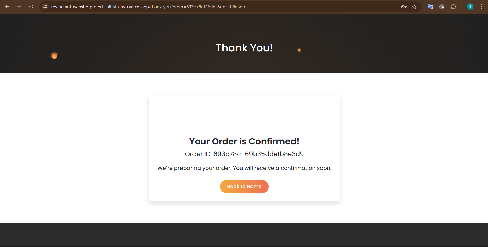

## tracking Order
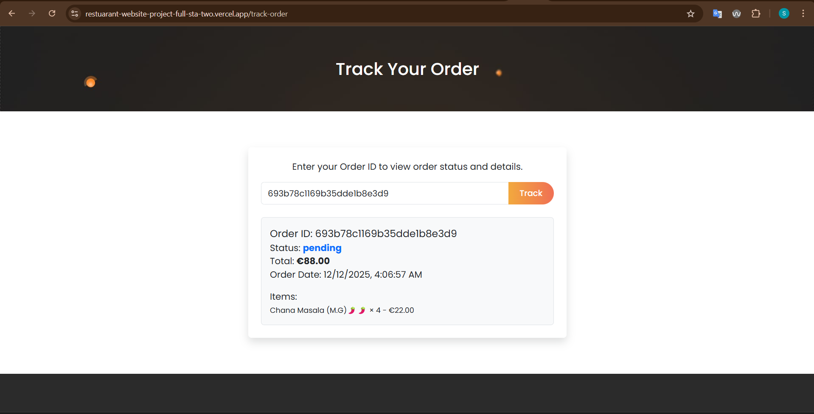


----

**Admin Testing**

## Admin Credentials
- **Email:** shafiullah7425@gmail.com  
- **Password:** 12345678  

---

Login as admin at /login

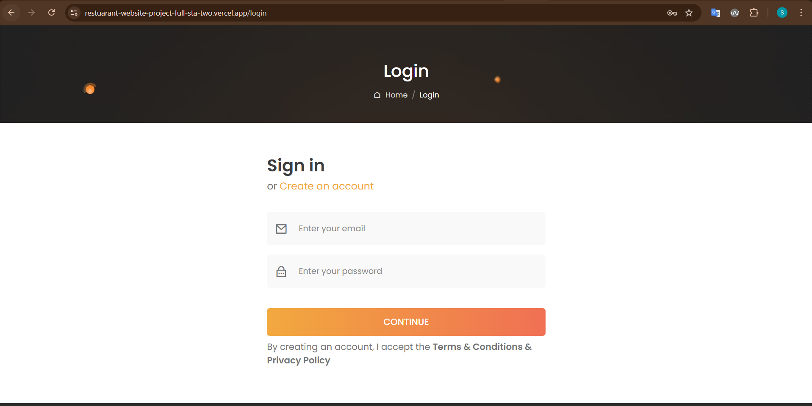

## Access /dashboard to verify:

- Total users and active users display correctly

- Orders: filter, search, view modal, update status

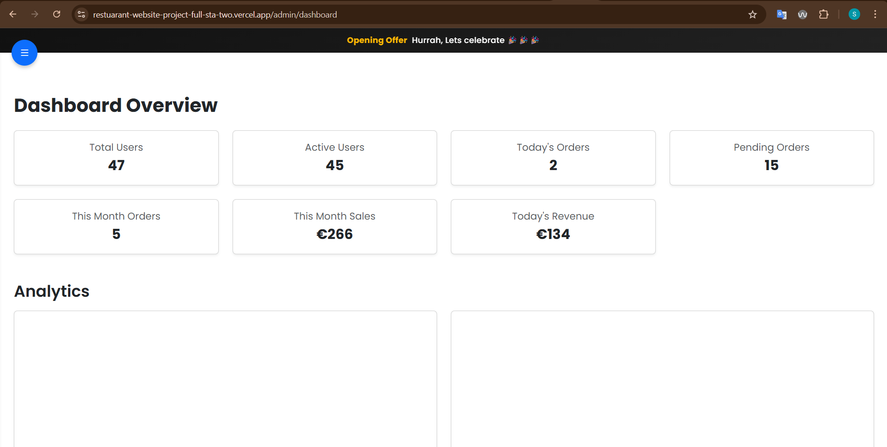

## Dishes: add, edit, delete

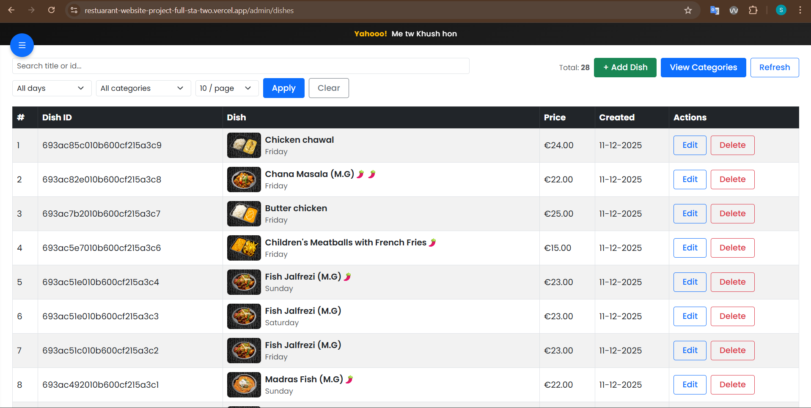


## Blogs: add, edit, delete

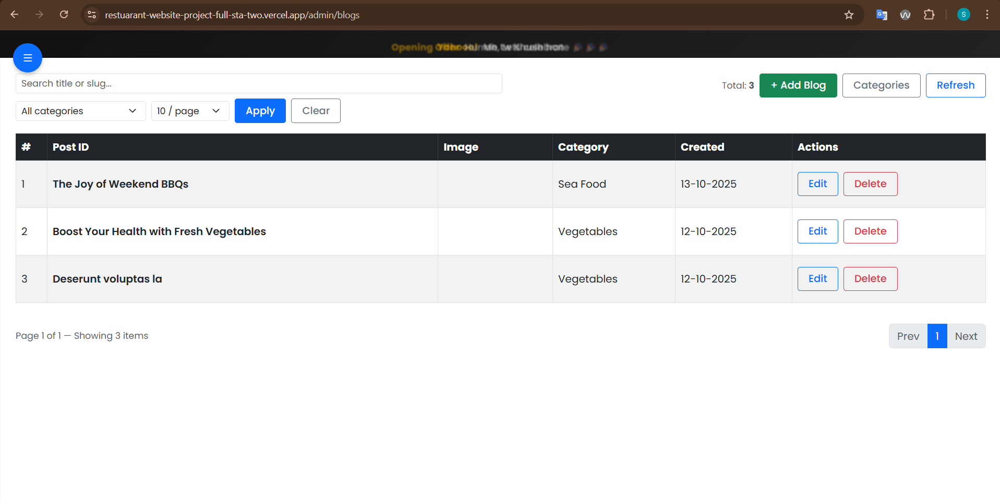

## Announcements: add schedule, slider displays correctly

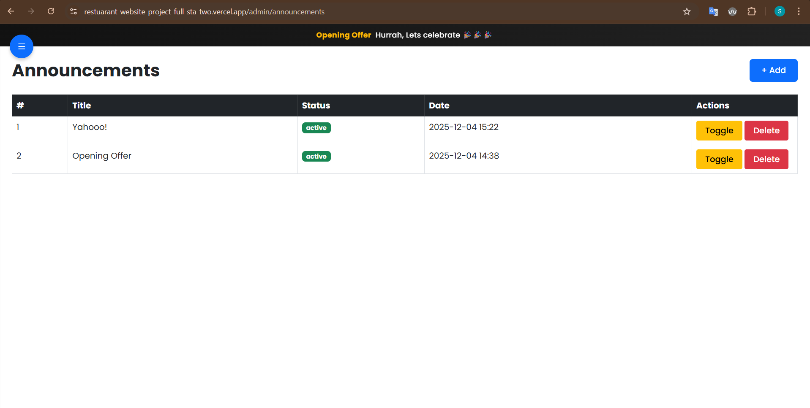

Verify analytics charts update according to orders

## User Testing

Register/login as a normal user

Browse homepage and announcements slider

Place order and verify it appears in admin dashboard

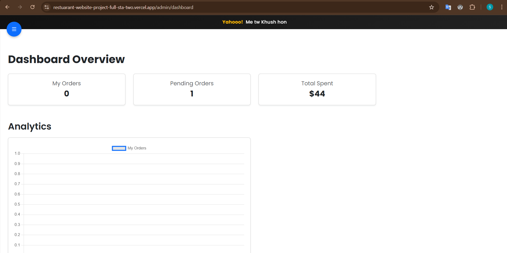

Check order status updates

General Testing

## Check responsiveness on mobile/desktop

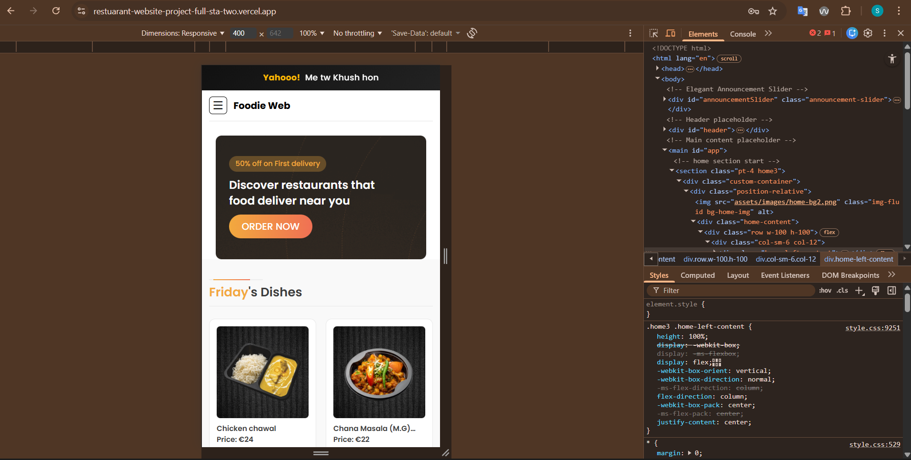

Ensure all forms validate input

Verify all modals, sliders, and filters work smoothly

Lighthouse result

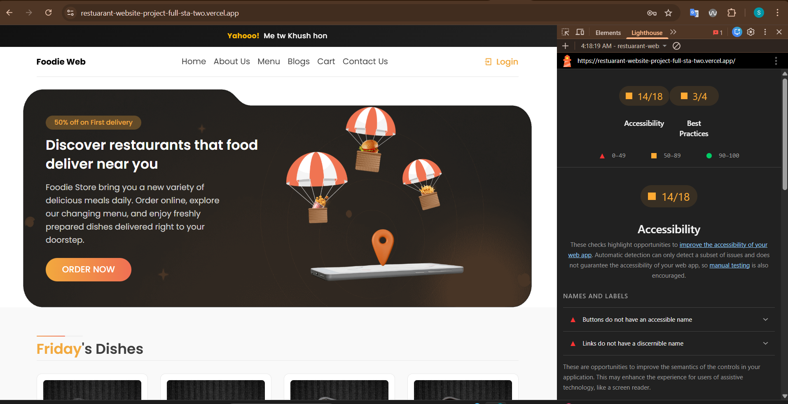